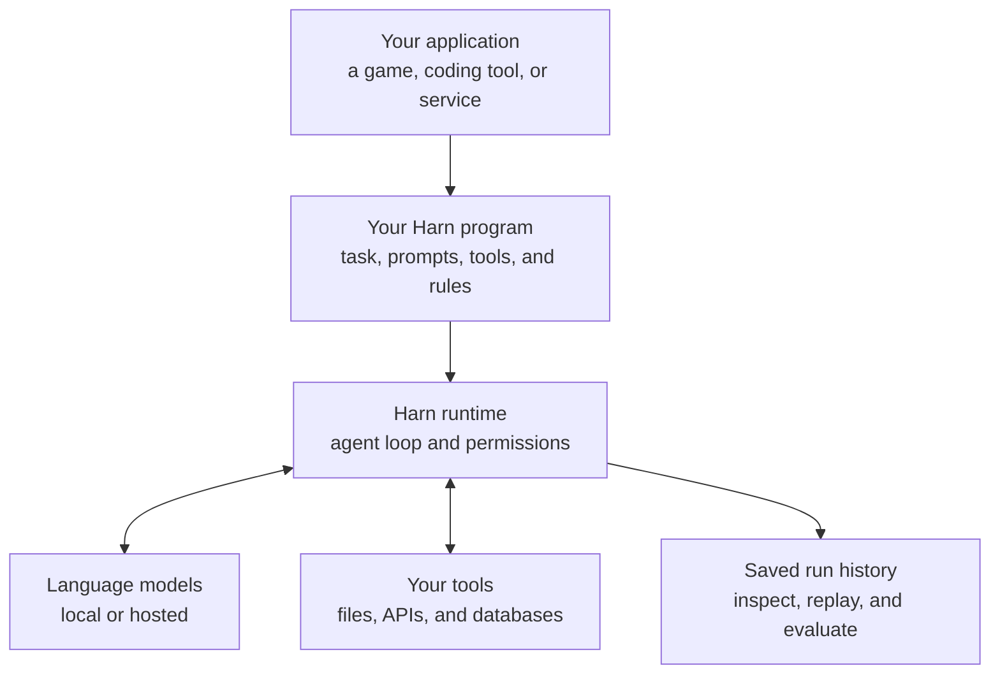

# Harn

Harn is a programming language and runtime for building AI agents.

You define the task, prompts, tools, and rules. Harn runs the conversation between
the model and your tools, enforces permissions, and saves the history of the work.
It handles differences between model providers so your application can use the
same agent code with local or hosted models.

Use Harn when your application needs an agent to take several steps: investigate
a failed job, review a change, or play a game. For example,
[20eq](https://github.com/burin-labs/20eq) is a 20 Questions game written in Harn,
and [Burin](https://github.com/burin-labs/burin-code) uses Harn in its coding
workbench.

> Harn is pre-1.0. The language, standard library, and CLI can change between
> releases. See the [release notes](https://github.com/burin-labs/harn/releases)
> and [changelog](CHANGELOG.md) before upgrading.

## Where Harn fits



Your application supplies its own behavior and interface. Harn manages the model
calls, tool requests, and execution state underneath it. You choose which tools
the agent can use and what those tools may access.

## An agent in Harn

This agent reads a project's README and summarizes it. Its only tool reads files;
the task doesn't require it to edit code or run commands.

```harn,check
import { agent_loop } from "std/agent/loop"
import { AgentSpec } from "std/agent/options"

fn main(harness: Harness) {
  tool read_project_file(path: string) -> string {
    description "Read a file in the project"
    return harness.fs.read_text(path)
  }
  const options: AgentSpec = {
    loop_until_done: true,
    tools: read_project_file,
    max_iterations: 8,
  }
  const result = agent_loop(
    harness,
    "Read README.md and summarize what this project does.",
    "Ground your answer in the files you read. Cite their paths.",
    options,
  )
  harness.stdio.println(result.status)
  harness.stdio.println(result.visible_text)
}
```

The loop asks the model what to do, runs the requested tool, and returns its result
to the model. It stops when the task ends or a limit is reached. The returned
status distinguishes completion from errors and exhausted budgets.

Save the example as `main.harn` in a project with a README. After
[configuring a model](docs/src/provider-setup.md), run `harn run main.harn`.
Hosted models need the provider's credentials and may incur charges.
The [agent-loop guide](docs/src/llm/agent_loop.md) covers tools, limits, and
longer conversations.

## Try Harn

Install the release binary on macOS or Linux:

```bash
curl -fsSL https://harnlang.com/install.sh | sh
```

The installer verifies release checksums and installs the tools for your platform.
See [getting started](docs/src/getting-started.md) for Windows, source builds, and
your first project. For a pinned version in automation, use the
[bootstrap guide](docs/src/dev/bootstrap-harn.md).

You can try the bundled demos without an API key:

```bash
harn demo --list
harn demo merge-captain
```

These demos replay recorded model responses. They show the workflow without
calling a provider. Use the [getting-started tutorial](docs/src/getting-started.md)
to set up a real model and create your own project.

## See what happened

A saved run history helps answer practical questions: which tool failed, what
the model saw, and where the agent stopped. Harn calls the JSON index for that
history a *run record*. It links the execution's events, results, and artifacts.

Open the local portal to inspect your runs:

```bash
harn portal
```

The [portal guide](docs/src/portal.md#how-to-read-it) shows the timeline, model
calls, token use, and reported cost. The
[debugging guide](docs/src/debugging.md) explains how to investigate failures.
[Replay](docs/src/cookbooks/replay-time-travel.md) lets you investigate recorded
execution, and [sessions](docs/src/sessions.md) let you continue agent work across
calls. The available history and recovery options depend on what the run recorded.

## What Harn handles

| Need | Harn provides |
| --- | --- |
| Call different models | A shared interface for model responses, tool calls, and provider settings. |
| Keep an agent under control | Tool permissions, execution limits, and stop and steer controls. |
| Coordinate several steps | Workflows with dependencies, retries, and saved execution state. |
| Delegate work | Child agents with their own context and a recorded link to the parent. |
| Manage long conversations | Sessions, context selection, and conversation compaction. |
| Test changes | Recorded responses, capability fixtures, replay, and evaluation tools. |
| Connect an existing application | CLI commands, packages, and editor and agent protocols. |

Harn owns execution and its history. Your application owns its interface,
approval presentation, and how changes appear to people, including undo and redo.
See [the mental model](docs/src/concepts/mental-model.md) for the design, and
[sandboxing](docs/src/sandboxing.md) for the permission boundary.

## Learn more

- **Start building:** [first workflow](docs/src/tutorials/build-your-first-workflow.md),
  [code review agent](docs/src/tutorial-code-review-agent.md), or
  [MCP server](docs/src/tutorial-mcp-server.md).
- **Connect a host:** [editor integration](docs/src/acp-editor-hosts.md),
  [MCP, ACP, and A2A](docs/src/mcp-and-acp.md), and
  [deployment on Fly.io](docs/src/deploy/fly.md).
- **Look up an API:** [language basics](docs/src/language-basics.md),
  [CLI reference](docs/src/cli-reference.md), and
  [builtins](docs/src/builtins.md).
- **Explore the design:** [why Harn](docs/src/why-harn.md),
  [workflow execution](docs/src/workflow-runtime.md), and
  [glossary](docs/src/concepts/glossary.md).

The full documentation is at [harnlang.com](https://harnlang.com/).

## Contribute

Harn is written in Rust. The repository also contains its standard library,
formatter, language server, debugger, editor grammar, and documentation.

See [CONTRIBUTING.md](CONTRIBUTING.md) for setup, checks, and pull requests.
Maintainer commands live in the [release guide](docs/src/maintainer-release.md).

Harn is available under the [Apache 2.0](LICENSE-APACHE) or [MIT](LICENSE-MIT)
license.
