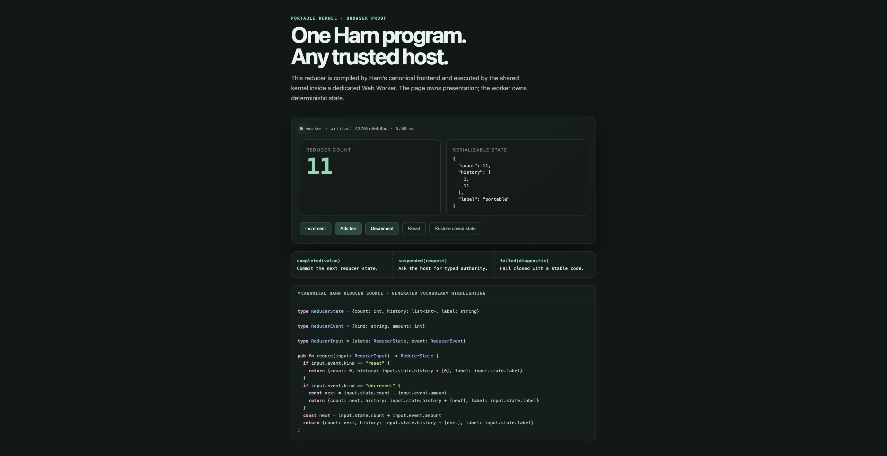

# Harn browser WebAssembly adapter

`harn-wasm` projects the shared `harn-kernel` compiler and execution state
machine into browser-ready ES modules with `wasm-bindgen`. It defines no
separate parser, evaluator, opcode table, builtin registry, or host authority;
the compiled module contains the shared frontend and kernel.

Use the repository Make targets:

```console
make wasm-check
make wasm-demo
```



The checked WIT contract is in `wit/harn-kernel.wit`. Browsers load the core
Wasm adapter because they do not execute Component Model artifacts directly. See
the [portable execution explanation](../../docs/src/concepts/portable-execution.md),
[contract reference](../../docs/src/portable-kernel-reference.md), and
[browser guide](../../docs/src/portable-kernel-browser.md).

## Generated highlighting vocabulary

The demo does not maintain a keyword list. `spec/language-vocabulary.json` is a
generated projection of the canonical lexer keywords and live stdlib builtin
registry. The docs, website TypeScript highlighter, and browser demo consume
generated projections of that one vocabulary. After a keyword or builtin
change, run:

```console
make gen-highlight
make check-highlight
make check-tree-sitter-keywords
```

Tree-sitter remains the structural grammar owner; its keyword projection is
checked against the same lexer source.
