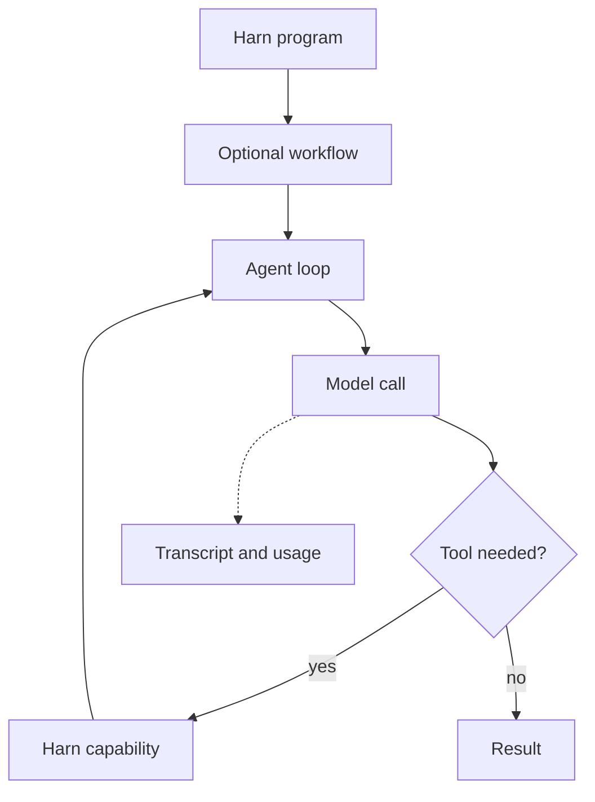

# Mental model

Think of a Harn program as a task moving through a model, tools, and a
recorded run. Add a loop or a workflow only when the task needs it.

## The building blocks

| Building block | What it does |
|---|---|
| **Model call** | Sends one request and returns one response. Use `harness.llm.call`. |
| **Tool call** | Runs a capability that the model selected or that your program called. |
| **Agent loop** | Repeats model and tool turns until the task reaches a terminal state. Use `agent_loop`. |
| **Workflow** | Names stages and their dependencies. Use it when several steps must be inspected, joined, retried, or resumed. |
| **Pipeline** | The top-level Harn program that owns the run. |
| **Transcript** | The structured record of model messages, tool calls, events, and results. |
| **Worker** | A child execution context that can run its own loop and transcript. |

These pieces are composable. A workflow can contain agent loops. An agent loop
can call tools. A pipeline can run several workers in parallel.

## Sessions and transcripts

A session gives related calls a durable conversation boundary. A transcript is
the record inside that boundary. Keep a session when later calls need earlier
messages; use a fresh session when the tasks should not share context.

Transcripts also support rendering, replay, evaluation, and audit. The host can
choose how to display them without taking ownership of their lifecycle.

## Workers

Use a worker when a parent program must delegate independent or long-running
work. A worker has its own loop and transcript. The parent can wait for it,
send input, suspend it, resume it, or close it.

Workers are an orchestration boundary, not a replacement for your host's UI or
approval system. See [delegated workers](../llm/agent_loop.md#delegated-workers)
and [the host boundary](../host-boundary.md).

## Choosing a level

Start with [`harness.llm.call`](../llm/llm_call.md). Move up the stack only when
you need the behavior in the next row:

1. One response: model call.
2. Several model/tool turns: agent loop.
3. Named dependent stages: workflow.
4. Independent or long-running child work: worker.

The [abstraction ladder](./abstraction-ladder.md) gives more examples.
