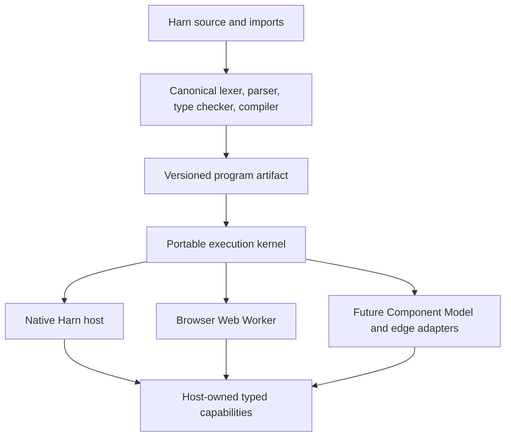
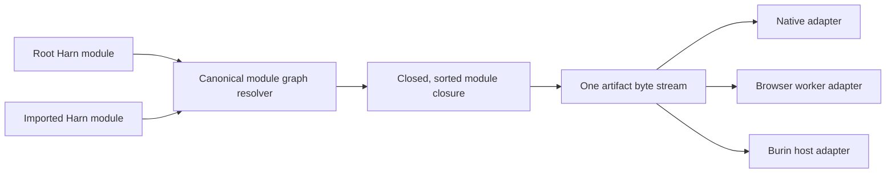
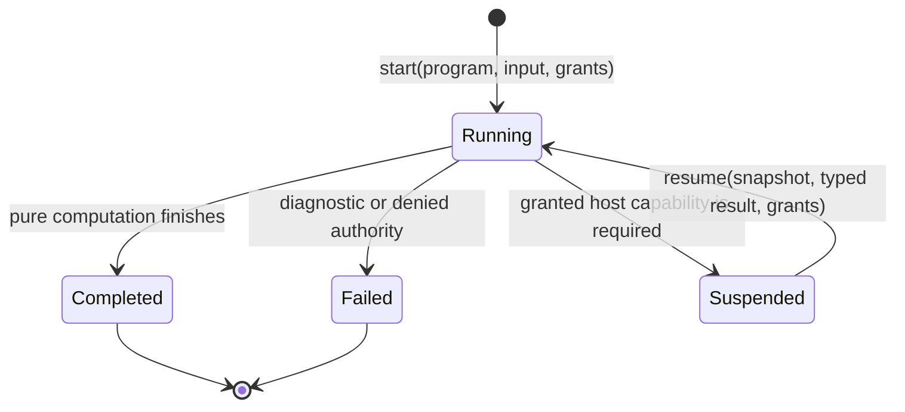

# Portable execution

Harn has one language implementation and more than one place to run it. The
portable kernel makes WebAssembly an adapter for Harn, not a second Harn
language.

The artifact contains checked bytecode and metadata. It contains no filesystem,
network, process, clock, randomness, or model authority. Native Rust and browser
WebAssembly decode the same bytes and call the same execution kernel.

For a program with imports, the compiler first resolves a closed package graph.
The graph is compiled in a stable order and its module identities, imports, and
export projections are stored in the artifact. A host never has to re-resolve a
source import after compilation:

`compile(source, ...)` remains the smallest API for a self-contained module.
`compilePackage(manifest, ...)` is the load-bearing API when imports are
present. The browser demo's JSON manifest is generated from its checked-in
`.harn` sources by `harn portable package` through
`make gen-portable-demo-package`; it is a delivery projection, not a second
source language.

## How the surfaces stay synchronized

The ecosystem does not treat a failing drift check as the primary integration
mechanism. Each relationship uses the strongest available form:

| Relationship | Mechanism |
|---|---|
| Native VM and browser Wasm semantics | Both depend directly on `harn-kernel`; neither owns a second compiler, opcode enum, value contract, or builtin vocabulary. |
| Capability methods | Macro declarations generate one immutable manifest used by parser, type checker, native VM, artifact fingerprint, and portable grants. |
| Language keywords and highlighting | One lexer declaration generates tokenization plus keyword/literal projections; docs, website, playground, REPL, LSP, and tree-sitter consume generated or direct projections. |
| Benchmark receipts and limits | One kernel type owns serialization and validation; the CLI and browser use it directly, and a generator writes the public JSON Schema. |
| WIT tooling input | WIT remains the standards-facing source; pinned `wasm-tools` generates its committed JSON projection. |
| Independent target behavior | Differential corpus tests compare exact native and browser results and diagnostics. This is a proof boundary, not synchronization between duplicate implementations. |

Generated-artifact checks catch broken wiring or stale committed delivery
files. They do not compensate for parallel semantic owners.

## A cooperative authority boundary

Execution advances until one of three transitions occurs:

A suspension is explicit. The kernel does not block a browser thread, poll a
clock, or depend on JavaScript Promise Integration. The host receives a typed
request and an authenticated snapshot. It decides whether and how to perform
the operation, then supplies a result carrying the same request identifier.

This design makes least authority visible. A browser can grant a small local
capability while a server host grants a different implementation of the same
contract. Code cannot gain ambient authority merely because it moved between
hosts.

## Placement and concurrency

The artifact and its decoded program image are immutable. A native host may
share that image across operating-system threads, with a separate execution
state, fuel budget, grant set, and suspension snapshot for every invocation.
This supports parallel reducer dispatch without introducing scheduler behavior
into Harn semantics.

A browser host uses the same rule at a different boundary: run each execution
lane in a dedicated Web Worker and send typed values and artifact bytes through
worker messages. The portable kernel does not depend on Wasm threads,
`SharedArrayBuffer`, atomics, or JavaScript Promise Integration. That keeps the
adapter usable on browser and edge deployments that do not expose the same
threading features. It also means one CPU-heavy execution is cooperative only
at a terminal or capability-suspension boundary; the host should isolate it
from the browser main thread and enforce fuel limits.

## Why the artifact targets a kernel rather than Wasm instructions

Compiling every Harn construct directly to WebAssembly would introduce another
semantic owner. Language changes would then require coordinated changes to two
compilers, two lowering paths, and target-specific builtins. Instead, Harn
compiles its canonical execution kernel to core Wasm. Direct native or Wasm
code generation can be added later as an accelerator behind the artifact
contract, after measurement, without owning language behavior.

The immediate browser adapter uses `wasm-bindgen --target web`, which produces
browser-ready ES modules and supports current Chrome, Firefox, Safari, and Edge.
The WIT world is checked as the portable interface contract, but browsers do
not yet execute components directly. A future Component Model adapter can use
`jco` to transpile a component to JavaScript and core Wasm when that reduces
deployment work.

WASI 0.3 now standardizes native async functions, streams, and futures, so it
is a credible future server adapter. It is not the semantic owner: runtime
support remains deployment-specific, and some edge platforms still expose
only partial or experimental WASI support.

## Tooling and dependency decision

The kernel reuses dependencies already present in the Harn workspace. The
browser adapter adds no new third-party production dependency; it links the
same regex and hashing implementations as the native VM instead of recreating
them for Wasm. The relevant packages and pinned tools are:

| Package | Scope and reason | License | Maintenance evidence checked 2026-08-01 | Browser size cost |
|---|---|---|---|---:|
| [`wasm-bindgen`](https://github.com/wasm-bindgen/wasm-bindgen) 0.2 | Existing generated core-Wasm/JavaScript boundary | MIT or Apache-2.0 | Workspace lockfile resolves 0.2.126; active upstream repository | Included in the measured module; not newly introduced |
| [`regex`](https://github.com/rust-lang/regex) 1.13.0 | Shared native/Wasm regular-expression semantics, including Unicode behavior | MIT or Apache-2.0 | Existing workspace dependency; active Rust project | Included in the measured cutover delta |
| [`sha2`](https://github.com/RustCrypto/hashes) 0.11.0 | Shared native/Wasm SHA-256 implementation | MIT or Apache-2.0 | Existing workspace dependency; active RustCrypto project | Included in the measured cutover delta |
| `harn-secret-catalog` | Internal canonical secret-pattern catalog shared by both runtimes | Harn workspace license | Maintained in this repository | No third-party dependency |
| `wasm-bindgen-test` 0.3 | Development-only real-browser worker tests | MIT or Apache-2.0 | Maintained in the same active upstream repository | 0 bytes in release artifacts |
| [`wasm-pack`](https://github.com/wasm-bindgen/wasm-pack) 0.15.0 | Pinned development/CI build and browser-test driver | MIT or Apache-2.0 | 0.15.0 released in May 2026 | 0 bytes; installed tool only |
| [`wasm-tools`](https://github.com/bytecodealliance/wasm-tools) 1.255.0 | Pinned development/CI WIT parser and JSON projection | MIT, Apache-2.0, or Apache-2.0 with LLVM exception | Active Bytecode Alliance repository with versioned releases | 0 bytes; installed tool only |

`jco` was evaluated but is not installed. It would add a transpilation and
packaging layer without removing the core-Wasm browser adapter while browsers
cannot load components directly. Revisit it when a Component Model artifact
reduces deployment work rather than duplicating it.

## Current boundary

The portable kernel supports a proved pure subset plus typed host capability
suspension. The full native VM still owns hostful orchestration, concurrency,
and other unavailable operations. A closed artifact may contain those paths so
one real application package does not need a portable-only source fork; the
kernel returns an exact unsupported diagnostic if execution reaches one.
Callers must not interpret “portable” as “all Harn programs.” See the [contract
reference](../portable-kernel-reference.md) for the exact boundary.

The unchanged logo-studio package is the reference boundary test. Its complete
source closure compiles into one 927,272-byte artifact. With no grants, its
first privileged operation fails at `fs.source_dir`. With typed grants, the
same artifact suspends and resumes through `fs.source_dir`, `env.get_or`, and
`fs.exists`, then reaches `tool_registry`. That final operation stores Harn
closures as host callbacks, which cannot cross the portable data-value ABI.
It remains an exact `unsupported_builtin` boundary until Harn has one canonical
callback-registration contract; the portable kernel does not grow a second
tool registry to hide that seam.

## Primary references

- [`wasm-bindgen` browser support](https://rustwasm.github.io/docs/wasm-bindgen/reference/browser-support.html)
- [Testing `wasm-bindgen` in browser workers](https://rustwasm.github.io/docs/wasm-bindgen/wasm-bindgen-test/browsers.html)
- [The WebAssembly Component Model and `jco`](https://component-model.bytecodealliance.org/running-components/jco.html)
- [WASI releases](https://wasi.dev/releases)
- [Cloudflare Workers WebAssembly constraints](https://developers.cloudflare.com/workers/runtime-apis/webassembly/)
