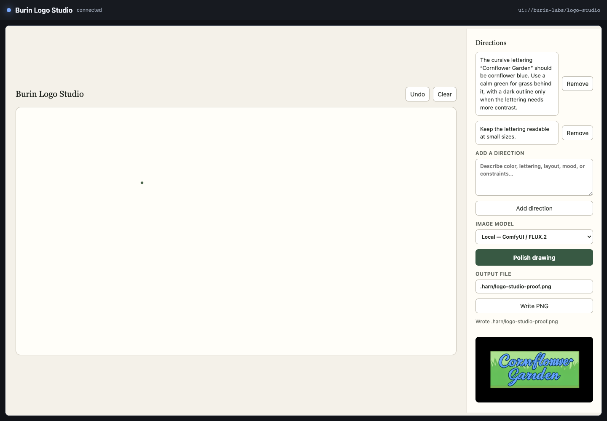

# Build an interactive Harn app

This guide builds a stateful app without app-specific JavaScript or Rust. The
complete small example is
[`examples/apps/decision-card.harn`](https://github.com/burin-labs/harn/blob/main/examples/apps/decision-card.harn).

## 1. Declare a shared-renderer resource

```harn
import * as ui from "std/ui"
import { UiElement } from "std/ui/contracts"

const resource = ui.app_resource(
  "ui://example/decision-card",
  "Decision Card",
  "decision.handle_event",
)
```

`ui.app_resource` packages the shared renderer as a standard
`text/html;profile=mcp-app` resource. The third argument names the one Harn tool
that receives UI events.

## 2. Render state as a document

```harn
fn render(choice: string, revision: int) {
  const elements: list<UiElement> = [
    {id: "card", kind: "column", variant: "panel"},
    {
      id: "choice",
      kind: "select",
      parent: "card",
      label: "Decision",
      value: choice,
      options: [
        {value: "approve", label: "Approve"},
        {value: "revise", label: "Request changes"},
      ],
    },
  ]
  return ui.update(ui.document("Decision Card", revision, elements))
}
```

Parents must be rows or columns and appear before their children. IDs are
unique and stable across renders. `ui.document` rejects invalid IDs and parent
links before they reach a browser.

## 3. Handle typed events

```harn
fn handle_event(raw) {
  const event = ui.event(raw.event)
  if event.kind == "input" && event.target == "choice" {
    choice = event.value ?? "approve"
  }
  revision = revision + 1
  return render(choice, revision)
}
```

Treat `raw` as untrusted. `ui.event` checks the schema, event kind, target, and
canvas coordinates from `0.0` to `1.0` once at the boundary.

## 4. Register the tool and resource

Give the tool an object return schema. Harn then sends the `UiUpdate` as MCP
`structuredContent`, which avoids parsing presentation text.

```harn
tools = tool_define(
  tools, "decision.handle_event", "Apply one UI event", {
    parameters: {event: {type: "object", required: true}},
    returns: {type: "object"},
    handler: handle_event,
    meta: ui.tool_metadata(resource, {visibility: ["app"]}),
  })
harness.tools.mcp_tools(tools)
harness.tools.mcp_resource(ui.mcp_resource(resource))
```

Use `visibility: ["app"]` when the model does not need to call the event tool.

## 5. Run and test

```sh
harn app run examples/apps/decision-card.harn
```

Test the Harn event handler in process with `ui.test.run`. It follows scheduled
`send_event` effects immediately, so polling and recovery tests do not use real
sleeps. Use the standalone host for the final pointer, focus, accessibility,
and screenshot checks.

For a larger app that restores drawings after restart, runs local and hosted
image models, cancels work, preserves exact logo text as a deterministic layer,
exports a reopenable design document plus editable SVG and PNG, and replays
recorded output, run:

```sh
harn app run examples/apps/logo-studio.harn
```

The replay model is offline. Local editing uploads the verified canvas capture
to the ComfyUI server named by `COMFYUI_URL`, then runs FLUX.2 Klein against
that reference image. Hosted editing expects `OPENAI_API_KEY` in the process
environment. The app paints its working state before sending the hosted call.
Unlike the queued ComfyUI path, that hosted request cannot be canceled after it
has been sent.

Exact lettering belongs in `std/media/composition`, not in the stochastic image
prompt. Keep a dedicated logo-text field, ask the model to polish the mark
without rendering words, then export with `design_document_export_result`. The
design document and SVG keep real text nodes; the PNG is the verified image
layer. Edit jobs also record the sketch URI on each candidate's `parents` list.

Prove the path in process with `conformance/tests/stdlib/logo_studio_path.harn`
(`ui.test.run` plus a fake model backend). Use the standalone host for pointer,
focus, accessibility, and screenshot checks.

The local path below used a mouse sketch, two directions, and FLUX.2 Klein on
an RTX 5090. The app uploaded the verified canvas capture, showed the returned
image, and exported the layered design document, editable SVG, and PNG through
the selected output stem.



## 6. Check interaction and recovery

Use stable element IDs so focus, tests, and host actions address the same
control after each update. Give every field a label, use heading levels in
order, give images useful alternative text, and provide buttons for canvas
actions that cannot be done with a keyboard.

Keep the last successful result visible when a new model call fails. Show the
failure in the app status, leave the retry action available, and disable any
setting that would change the backend of a running job. If cancellation fails,
keep tracking the job and try another status check.

Before writing a result file, create its parent directory and turn file errors
into app status instead of a broken tool call. Restart the host during the
manual test and confirm that strokes, directions, the selected model, a running
job, and the last verified image reopen from the app's work record.

The output field accepts a path relative to the app's working directory or an
absolute path allowed by the host's file policy. Keep that policy narrow when
embedding an app that should only write inside one project or export folder.

Check these edges before shipping:

- a click without pointer movement still creates a visible canvas dot;
- one stroke never sends more than 4,096 points;
- invalid element IDs, parent links, heading levels, canvas sizes, stroke
  widths, and non-finite coordinates fail before rendering;
- an unreachable provider returns a typed model-job error and a later retry
  can succeed;
- data-image previews load under the host and resource security policies;
- the write button reports an unwritable path without losing the generated
  asset.
