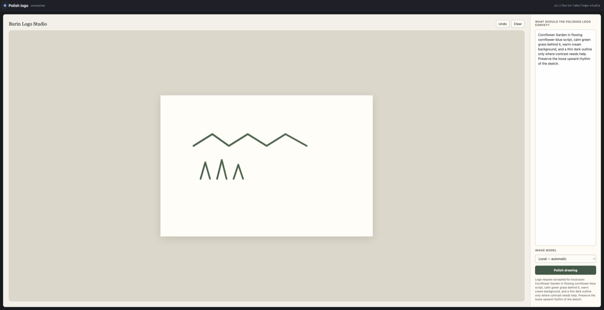

# MCP Apps UI resources

`std/ui_resource` packages interactive HTML widgets as portable UI resource
records that follow the [MCP Apps overview][mcp-apps] and fall back to text or
structured tool output when a host does not advertise UI support.

[mcp-apps]: https://apps.extensions.modelcontextprotocol.io/api/documents/overview.html

## Run an app locally

Register at least one UI resource and one linked tool, then launch the same
script in Harn's standalone host:

```sh
harn app run examples/apps/logo-studio.harn
```

The host binds to a random loopback port, opens the default browser, and puts
the app inside a separate-origin sandbox proxy. Use `--no-open` in automation,
`--bind 127.0.0.1:4321` for a stable port, or `--resource ui://...` to select
among multiple declared views. Non-loopback binds are rejected; deploy remote
apps through an authenticated host instead.



For new applications, use [`std/ui`](../stdlib/ui.md) so product state and
behavior stay in Harn. Use `std/ui_resource` directly when you already have a
portable HTML view.

The app view speaks standard MCP JSON-RPC over `postMessage`. Calls to
`tools/call` and `resources/read` are checked by the host and sent to the
same in-process MCP server used by `harn serve mcp`; app-only tool visibility is
therefore enforced at the protocol boundary rather than by UI convention. RPC
requests must also carry the exact host origin, which blocks another browser
origin or a DNS-rebinding page from driving tools through the loopback server.

```harn
import {
  ui_resource,
  ui_resource_to_mcp,
  ui_select_for_host,
  ui_structured_fallback,
  ui_tool_result,
  ui_tool_result_validate,
} from "std/ui_resource"

const resource = ui_resource(
  "ui://harn-dashboard/kpis@v1",
  "Weekly KPIs",
  weekly_kpi_html,
  {capabilities: ["tools/call", "resources/read"]},
)

harness.tools.mcp_resource(ui_resource_to_mcp(resource))

const result = ui_tool_result(
  resource,
  {structured_fallback: ui_structured_fallback({signups: 42, churn: 3})},
)

ui_tool_result_validate(result)
const rendered = ui_select_for_host(result, host_capabilities)
```

## Resource record

`ui_resource(uri, name, html, options?: UiResourceOptions)` returns
`UiResource` (`harn.ui_resource.v1`):

| Field | Purpose |
|---|---|
| `uri` | `ui://...` resource URI; hosts fetch this through their MCP resource interface |
| `mime_type` | Defaults to `text/html;profile=mcp-app`, matching the MCP Apps profile contract |
| `contents` / `contents_encoding` | UTF-8 (default) or base64-encoded HTML |
| `content_sha256` / `size_bytes` | Integrity hash and size for host caches and audit |
| `permissions` | Harn-level capability labels; browser permissions belong in `ui_resource_to_mcp` options |
| `capabilities` | JSON-RPC methods the resource may use over `postMessage` |
| `csp` | Source-list directives Harn surfaces back as a `Content-Security-Policy` header value via `ui_resource_csp_header` and a sandbox attribute via `ui_resource_sandbox_attr` |
| `validation` | Summary of the embedded `std/artifact/web` validation: `ok`, `error_codes`, `warning_codes` |
| `meta` | Free-form metadata for host-specific extensions |

Validation reuses [`std/artifact/web`](../modules.md#stdartifactweb)
so embedded UI payloads share the same network/secret/dangerous-navigation
rules used by safe artifact patching. The validator defaults to
`allow_host_bridge: true` because MCP Apps explicitly use
`parent.postMessage` as the host bridge; tighten the policy by passing
`{validation: {allow_host_bridge: false}}` to `ui_resource`.

## Tool-declaration metadata

`ui_tool_meta(resource, options?: UiToolMetaOptions)` returns a
`UiToolMeta` (`harn.ui_tool_meta.v1`) record and
`ui_tool_meta_to_mcp(meta)` serializes it into the stable MCP Apps shape
served from a tool's `_meta.ui`:

| MCP key | Harn field |
|---|---|
| `resourceUri` | `ui.resource_uri` |
| `visibility` | `ui.visibility` (some combination of `model` and `app`) |

Use `visibility: ["app"]` for tools callable only by the embedded app,
`["model"]` for model-only tools, and `["model", "app"]` for both.

`ui_resource_to_mcp(resource, options?)` produces the exact record accepted
by `harness.tools.mcp_resource`. Its `meta.ui` block carries the resource
CSP domains, browser permissions, dedicated domain, and border preference;
Harn's MCP server projects it as `_meta.ui` on both resource discovery and
`resources/read` content. External domains and permissions default empty.

## Fallbacks

`ui_tool_result(resource, options?: UiToolResultOptions)` wraps a resource
with a mandatory text fallback (defaulting to a `web_artifact_text_fallback`
text copy of the resource HTML) and an optional `UiStructuredFallback`.
Wrap raw structured data with
`ui_structured_fallback(data, options?: UiStructuredFallbackOptions)`.
Hosts without UI support receive both fallbacks instead of the
resource:

| Host capability | `ui_select_for_host` selection |
|---|---|
| `apps: true` and resource validation passed | `ui_resource` |
| Otherwise, structured fallback present | `structured_fallback` |
| Otherwise | `text_fallback` |

`ui_host_capabilities(input?: UiHostCapabilityInput)` accepts the current MCP
extension shape at
`capabilities.extensions["io.modelcontextprotocol/ui"].mimeTypes`, older
`client_capabilities.apps` shapes, the OpenAI Apps SDK `ui.apps` shape, or a
bare `{apps: true}` record. `ui_host_supports_apps(caps)` returns
whether the host can render the `mcp-app` profile.

## Message records

`ui_tool_call_envelope(name, params?, options?)` produces the
host→guest JSON-RPC `tools/call` payload a sandboxed iframe receives
through `window.parent.postMessage`. `ui_context_update_envelope(key,
value, options?)` produces the stable guest→host
`ui/update-model-context` request, storing the keyed value in
`structuredContent` for future model turns.

## Validation contract

`ui_tool_result_validate(result)` rejects:

- Missing or empty text fallbacks.
- Tool-meta blocks with the wrong schema.
- UI resources whose HTML failed validation (network calls, host
  bridge abuses, dangerous navigation, embedded secrets).
- Structured fallbacks that do not match the
  `harn.ui_fallback.structured.v1` schema.

`ui_tool_result` already withholds the resource when validation fails,
so the typical flow is: build the resource, build the result, validate,
then dispatch through `ui_select_for_host`. Set
`allow_invalid_resource: true` for preview-only renders where the
host needs to surface validation errors without shipping the resource;
`ui_tool_result_validate` still refuses that record so previews stay
explicit.

The standalone host advertises the current extension during startup and sends
`serverTools`, `serverResources`, `logging`, and enforced sandbox settings to
the view. It reads the current `_meta.ui.resourceUri` tool link and the
deprecated flat `_meta["ui/resourceUri"]` link for compatibility.

Start with the shared renderer in
[`examples/apps/decision-card.harn`](https://github.com/burin-labs/harn/blob/main/examples/apps/decision-card.harn).
Use [`examples/ui_resource/dashboard-widget.harn`](https://github.com/burin-labs/harn/blob/main/examples/ui_resource/dashboard-widget.harn)
and [`examples/ui_resource/review-form.harn`](https://github.com/burin-labs/harn/blob/main/examples/ui_resource/review-form.harn)
when the app needs its own portable HTML and JavaScript.
