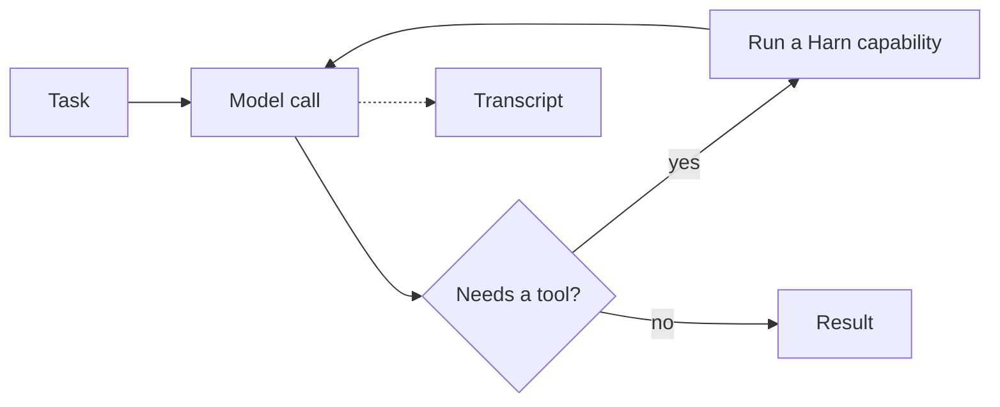

# Harn

Harn is a programming language and runtime for building AI agents. It gives
model calls, tools, retries, concurrency, transcripts, and workflows one
place to run.

```harn,check title="example.harn"
fn main(harness: Harness) {
  const response = harness.llm.call(
    "Explain quicksort in two sentences.",
    "You are a computer science tutor.",
    { provider: "mock" }
  )
  harness.stdio.println(response.text)
}
```

The example uses the `mock` provider, so it runs without an API key. Start with
[Getting started](./getting-started.md) to install Harn and run it.

## The core idea

Most agent programs coordinate a few recurring actions:

1. Ask a model for the next step.
2. Give the model tools when it needs to act.
3. Repeat until the task is complete.
4. Run independent work in parallel, retry temporary failures, and keep a
   record of what happened.

Harn makes that coordination part of the program instead of leaving it to
several host-side libraries.



## Choose the smallest useful building block

| Need | Start with |
|---|---|
| One request and one response | [`harness.llm.call`](./llm/llm_call.md) |
| A model that can use tools across turns | [`agent_loop`](./llm/agent_loop.md) |
| Named stages with joins and retries | [`workflow_execute`](./workflow-runtime.md) |
| A complete Harn program | [`fn main`](./language-basics.md) and [pipelines](./language-basics.md#pipelines) |

Use [Concepts](./concepts/index.md) when you want the mental model. Use
[Common tasks](./common-tasks.md) when you know what you want to build.

## What Harn owns

Harn owns the reusable agent behavior: orchestration, model and tool calls,
transcripts, replay and evaluation, worker lineage, and capability policy.

The host application still owns its native UI, approval flow, concrete file
changes, and product data. See [the host boundary](./host-boundary.md) when
you need to decide where a feature belongs.

## Documentation map

- [Tutorials](./getting-started.md): learn by building a small program.
- [How-to guides](./cookbook.md): complete one focused task.
- [Reference](./builtins.md): look up syntax, functions, options, and CLI flags.
- [Explanation](./concepts/index.md): understand design choices and system
  boundaries.

## Links

- [Language specification](./language-spec.md)
- [GitHub repository](https://github.com/burin-labs/harn)
