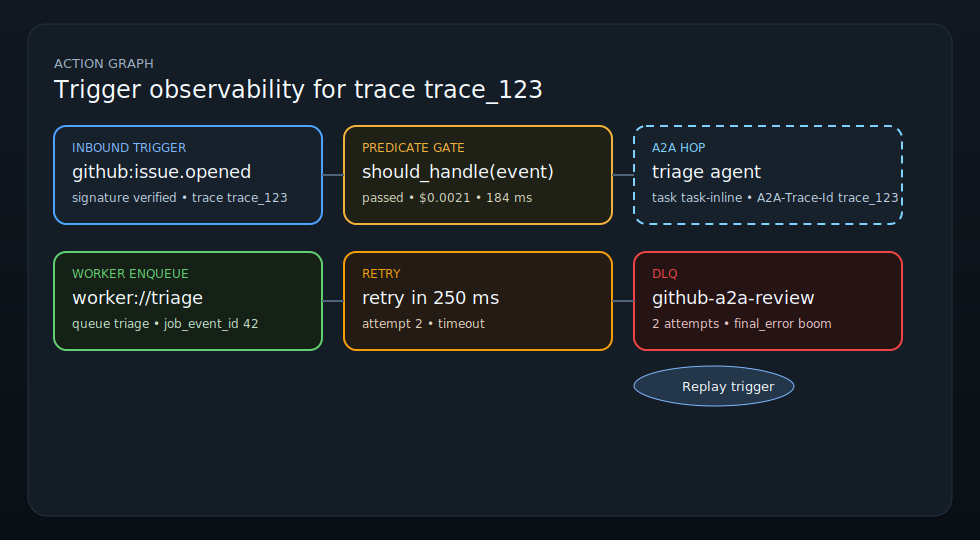

# Trigger Observability In The Action Graph

Harn projects trigger activity into both persisted run observability and the
live dispatcher event stream. The current surface includes `trigger`,
`predicate`, `dispatch`, `a2a_hop`, `worker_enqueue`, `retry`, and `dlq`
nodes, plus the matching `trigger_dispatch`, `predicate_gate`,
`a2a_dispatch`, `retry`, `dlq_move`, and `replay_chain` edges.

## What lands in this change

- A synthetic `trigger` node is added when a run carries a `trigger_event`
  envelope in `run.metadata`.
- Workflow `condition` stages render as `predicate` nodes in
  `observability.action_graph_nodes`.
- Local dispatch attempts render as `dispatch` nodes.
- Remote A2A dispatch attempts render as `a2a_hop` nodes labelled with the
  resolved `target_agent`.
- `worker://...` queue handoffs render as `worker_enqueue` nodes with queue
  name, response topic, and job receipt metadata.
- Retry scheduling emits `retry` nodes with delay/error metadata.
- Exhausted deliveries emit `dlq` nodes with final-error metadata.
- Entry edges from the trigger node into the workflow render as
  `trigger_dispatch`.
- Trigger or predicate edges into a remote A2A hop render as `a2a_dispatch`.
- Transitions leaving a predicate on the workflow path render as
  `predicate_gate`.
- Replay-triggered dispatches add a visible `replay_chain` edge back to the
  original trigger event.
- `trace_id` propagates from the `TriggerEvent` onto the synthetic trigger
  node and every downstream action-graph node derived from that run,
  including A2A hops and worker queue receipts.
- A2A dispatches also send the same trace on the wire via the
  `A2A-Trace-Id` HTTP header in addition to the JSON envelope metadata.

The runtime streams these updates onto the shared event-log topic
`observability.action_graph`. The portal subscribes to that topic for traced
runs and merges live node/edge updates into the detail view while still
showing the persisted run snapshot.

## Portal view

The portal run detail now renders dedicated node cards instead of a plain edge
dump:

- trigger cards show provider, event kind, signature status, and trace id
- predicate cards show pass/block state plus cost and latency
- A2A cards render with a dashed trust-boundary style and task metadata
- worker enqueue cards show queue and response-topic details
- DLQ and trigger cards expose a replay button that invokes
  `harn trigger replay <event-id>` through the portal backend



## Node metadata

Each `RunActionGraphNodeRecord` now carries a `metadata` map so the portal and
CLI consumers can render node-specific details without inventing a second
schema. Representative fields include:

- `trigger`: `provider`, `event_kind`, `dedupe_key`, `signature_status`
- `predicate`: `trigger_id`, `predicate`, `result`, `cost_usd`, `tokens`,
  `latency_ms`, `reason`
- `dispatch` / `a2a_hop` / `worker_enqueue`: `handler_kind`, `target_uri`,
  `attempt`, plus route-specific fields like `target_agent`, `task_id`,
  `queue_name`, `response_topic`, and `job_event_id`
- `retry`: `delay_ms`, `error`
- `dlq`: `attempt_count`, `final_error`

## Example

When a trigger is dispatched, the streamed action-graph updates now include
records like:

```json
{
  "kind": "trigger",
  "label": "cron:tick",
  "trace_id": "trace_123",
  "metadata": {
    "provider": "cron",
    "event_kind": "cron.tick",
    "signature_status": "unsigned"
  }
}
```

and:

```json
{
  "kind": "worker_enqueue",
  "label": "worker://triage",
  "trace_id": "trace_123",
  "metadata": {
    "queue_name": "triage",
    "response_topic": "worker.triage.responses",
    "job_event_id": 42
  }
}
```

with edges such as:

```json
{"kind": "trigger_dispatch", "from_id": "trigger:...", "to_id": "stage:..."}
{"kind": "predicate_gate", "label": "true"}
{"kind": "a2a_dispatch", "from_id": "predicate:...", "to_id": "a2a:..."}
{"kind": "retry", "from_id": "dispatch:...", "to_id": "retry:..."}
{"kind": "dlq_move", "from_id": "dispatch:...", "to_id": "dlq:..."}
```
