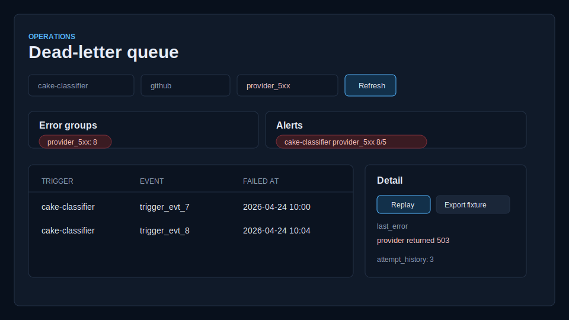

# Orchestrator DLQ management

Harn records failed trigger deliveries in `trigger.dlq`. The portal exposes
that event-log topic at `/dlq` so operators can inspect, replay, purge, and
export dead-letter entries without hand-reading JSONL or SQLite rows.



## Portal workflow

The `/dlq` route lists pending entries with:

- `trigger_id`
- `event_id`
- `failed_at`
- `last_error`
- `retry_count`
- derived `error_class`

Filters are applied server-side for trigger, provider, error class, state, text,
and time range. Selecting a row opens the full event payload, headers, attempt
history, and matching predicate lifecycle trace.

Actions:

- **Replay** starts a trigger replay job for the original event id.
- **Replay with drift accept** uses the same replay path but marks the portal
  job as an accepted-drift replay.
- **Purge** appends a discarded tombstone to `trigger.dlq` after confirmation.
- **Export fixture** downloads a `harn.dlq.fixture.v1` JSON fixture for
  conformance and regression tests.

Bulk operations use the current filters and are capped by the admin API. Replay
bulk jobs are rate-limited, and purge bulk jobs are intended for narrow filters
such as `error_class=unknown` with an age window.

## Admin API

The portal server exposes the DLQ admin API:

```text
GET  /api/dlq
GET  /api/dlq/{entry_id}
POST /api/dlq/{entry_id}/replay
POST /api/dlq/{entry_id}/replay-drift-accept
POST /api/dlq/{entry_id}/purge
GET  /api/dlq/{entry_id}/export
POST /api/dlq/bulk/replay
POST /api/dlq/bulk/purge
```

The list endpoint returns normalized entries, error-class groups, active spike
alerts, and configured alert destinations.

## Error classes

DLQ records are tagged when moved into the queue. Older records are classified
when read by the portal.

| Class | Meaning |
| --- | --- |
| `provider_5xx` | Upstream provider outage or server error. |
| `predicate_panic` | Trigger predicate crashed or threw. |
| `handler_panic` | Handler crashed or threw. |
| `handler_timeout` | Handler exceeded a wall-clock deadline. |
| `auth_failed` | Downstream authentication or authorization rejection. |
| `budget_exhausted` | Trigger or predicate budget short-circuited dispatch. |
| `unknown` | Fallback for uncategorized errors. |

## Alerts

Per-trigger DLQ alerts are configured in `harn.toml`:

```toml
[[triggers]]
id = "cake-classifier"
kind = "webhook"
provider = "github"
handler = "handlers.classify"

[[triggers.dlq_alerts]]
destinations = [
  { kind = "slack", channel = "#ops", webhook_url_env = "OPS_SLACK_WEBHOOK" },
  { kind = "webhook", url = "https://alerts.example.com/harn" },
]
threshold = { entries_in_1h = 5, percent_of_dispatches = 20.0 }
```

The portal surfaces active spike alerts when matching DLQ volume crosses the
configured `entries_in_1h` threshold. `percent_of_dispatches` is preserved in
the API response for integrations that compare DLQ volume to dispatch totals.
