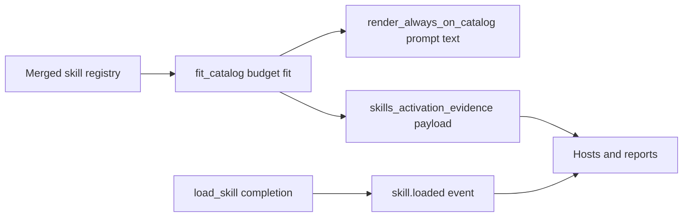

# Skill activation evidence

Harn owns one stable, host-consumable record of **what happened to each skill
this turn**: which short cards were shown, which were omitted and why, what each
cost against the catalog budget, and where each skill sits in the disclosure
lifecycle. Hosts — Burin, headless runs, cloud, the portal — read this record
instead of re-parsing the catalog prompt text.

This page describes the contract and the migration path from Burin's
product-side `skill_activation_report`.

## Where it comes from

The evidence is a projection of the pieces
[Skills](./skills.md) already produces — layered discovery, the merged
registry, catalog cards, the lazy `load_skill` body, and the skill lifecycle
events. It adds **no new discovery, loader, or registry behavior**. The one
thing it makes newly available is the *shown-vs-omitted-to-budget* decision as
structured data: that decision is computed by the same `fit_catalog` primitive
the prompt renderer (`render_always_on_catalog`) uses, so the evidence can never
disagree with the catalog the model actually saw.



## The builtin

```harn,ignore
skills_activation_evidence(registry: dict, options?: dict) -> dict
```

`registry` is a skill registry (`skill_registry()` / the pre-populated `skills`
global). `options` accepts:

| Key | Type | Default | Meaning |
|---|---|---|---|
| `budget` | int | `2000` | Catalog character budget, matching `render_always_on_catalog`. |
| `catalog_limit` | int | none | Cap on model-invocable cards, matching the loop's `catalog_limit`. Entries past it are omitted with reason `catalog_limit`. |
| `loaded` | list | `[]` | Skill ids whose body was pulled via `load_skill`. |
| `used` | list | `[]` | Skill ids whose loaded body drove a downstream action. |

`loaded` / `used` let a host fold the runtime lifecycle it already tracks (from
the `skill.loaded` / `skill_activated` events) into the same payload, so one
record answers *eligible vs loaded vs used*.

## The payload

```jsonc
{
  "_type": "skill_activation_evidence",
  "schema_version": 1,
  "budget_chars": 2000,     // effective character budget
  "used_chars": 812,        // characters the rendered catalog consumed
  "budget_tokens": 500,     // budget in tokens (shared 4-chars/token heuristic)
  "used_tokens": 203,
  "shown": ["deploy", "review"],   // ids whose card rendered
  "omitted": ["manual", "..."],    // ids whose card did not render
  "cards": [
    {
      "id": "deploy",
      "name": "deploy",
      "source": "project",                 // discovery layer label
      "description": "Ship the current build",
      "when_to_use": "when the user says deploy",
      "disable_model_invocation": false,
      "selected": true,                     // card rendered this turn
      "omitted_reason": null,               // budget | catalog_limit | disable_model_invocation
      "char_estimate": 74,
      "token_estimate": 19,
      "lifecycle": "shown",                 // eligible | shown | omitted | loaded | used
      "matched": null                       // {score, reason} when the host merged match evidence
    }
  ]
}
```

### Body lifecycle states

| State | Meaning |
|---|---|
| `eligible` | In the registry and model-invocable, but its card was not rendered this turn. |
| `shown` | Its short card was rendered into the catalog prompt. |
| `omitted` | Eligible but dropped before the model saw it (see `omitted_reason`). |
| `loaded` | Its full body was pulled via `load_skill` (from the `loaded` option). |
| `used` | Its loaded body drove at least one downstream action (from the `used` option). |

`used` and `loaded` override the registry-derived state, so a skill that was
both shown and later loaded reports `loaded`.

### Omitted reasons

| Reason | Meaning |
|---|---|
| `budget` | Dropped to keep the rendered catalog within `budget`. |
| `catalog_limit` | Trimmed before rendering because `catalog_limit` was already full. |
| `disable_model_invocation` | `disable-model-invocation` — never offered to the model. |

### `load_skill` completion metadata

The `skill.loaded` transcript event carries `lifecycle` (`loaded` on success,
`omitted` when a load is blocked), `source`, `disable_model_invocation`, and a
`token_estimate` of the body, alongside the existing provenance fields — so a
host can audit `eligible` vs `loaded` vs `used` from that event alone without
prompt parsing.

## Registry precedence stays deterministic

The evidence is built from the merged registry, which already resolves
collisions deterministically by layer — **bundled/CLI, runtime, host/project,
package, user** (see [layered discovery](./skills.md#layered-discovery)). A
duplicate skill name collapses to one winner before it reaches the payload; the
`source` field on each card records the winning layer.

## Migration note for Burin

Burin's product pipeline currently computes activation in
`lib/context/skill-activation.harn::skill_activation_report`, which mixes three
concerns:

1. **Fingerprint → skill selection** (`project_fingerprint`, `TAG_SKILL_MAP`,
   `detect_active_skill_report`) — *which* Burin-bundled cards apply to a repo.
2. **Card rendering + budget accounting** (`render_card_blocks_plan`,
   `rendered_names` / `omitted_names` / `card_tokens`) — the shown/omitted split
   and token cost.
3. **Product presentation** (`render_skill_activation_report`) — the
   human-facing card block wording.

### What moves into this Harn contract

- The **shown/omitted split, budget accounting, source metadata,
  `disable-model-invocation`, and body lifecycle** — concern (2) — is exactly
  what `skills_activation_evidence` now returns. Burin should read `shown`,
  `omitted`, `cards[].omitted_reason`, `cards[].source`, `cards[].token_estimate`,
  and `cards[].lifecycle` from Harn rather than recomputing them in
  `skill_activation_report`. The `rendered_names` / `omitted_names` /
  `card_tokens` / `suppressed_*` bookkeeping collapses into the Harn payload.
- The **`skill.loaded` lifecycle/costing metadata** replaces any Burin-side
  reconstruction of load state.

### What stays product UI in Burin

- **Fingerprint-driven selection** (concern 1). Choosing *which* project skills
  apply from a repo fingerprint is a Burin editor/product fact; it feeds the
  registry Burin hands to Harn, and stays in Burin.
- **Card block wording / rendering** (concern 3, `render_skill_activation_report`).
  Presentation is product UI. It should render *from* the Harn payload instead
  of from a parallel Burin-computed report.

### Release / version boundary

`skills_activation_evidence` and the enriched `skill.loaded` metadata ship in
the Harn release that first carries this schema (`schema_version: 1`). Burin
should consume the contract only after pinning that `.harn-version`. Until then,
Burin
[#3532](https://github.com/burin-labs/burin-code/issues/3532) can keep running
its existing `skill_activation_report` path unchanged — the two produce the same
shown/omitted decision because both budget on the same card text, so the cutover
is a swap, not a behavior change.
