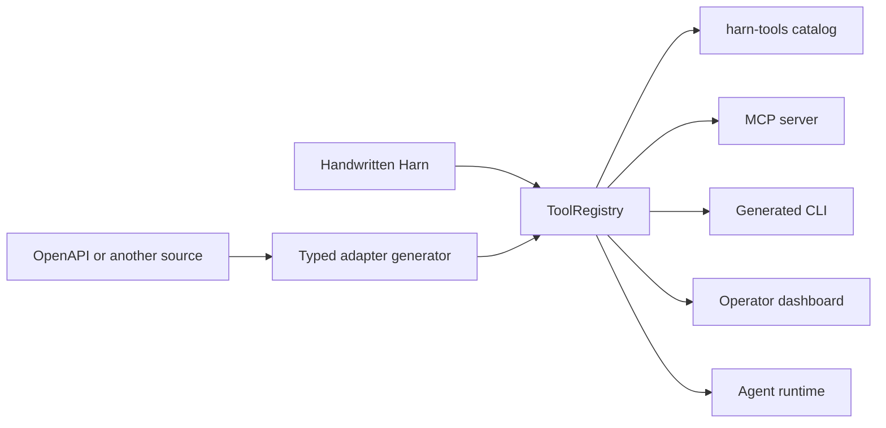

# Tool adapter architecture

Harn treats an integration as an executable typed registry, not as an MCP
server, a command-line program, or an OpenAPI document. Those formats are
inputs and projections around one runtime-owned contract.

## Why OpenAPI is an input

OpenAPI 3.1 already supplies most operation data Harn needs: stable operation
identifiers, descriptions, parameters, request and response JSON Schemas,
security declarations, and HTTP bindings. Its standard extension mechanism
also permits namespaced `x-harn` fields for presentation choices that are not
part of HTTP.

OpenAPI does not own executable handler closures, Harn capability authority,
approval policy, deferred tool loading, or the lifecycle of non-HTTP
integrations. It also does not describe MCP resources and prompts or every CLI
presentation choice. Making an OpenAPI-shaped catalog the runtime owner would
force handwritten, GraphQL, protobuf, database, and local-library integrations
through an HTTP-specific abstraction.

`harn-openapi` therefore translates operations into typed SDK functions and a
`ToolRegistry`. Its `x-harn` object only overrides metadata that OpenAPI does
not standardize. Future generators should end at the same registry boundary.

## The owning contract

A live `ToolRegistry` contains the portable contract and the executable handler
for each operation. Harn validates and normalizes it once when an adapter
publishes or projects the registry. The normalized entry contains:

- stable name, title, and description;
- input and output JSON Schemas;
- one declared execution backend, with a local handler closure for in-VM tools;
- Harn execution policy and protocol annotations;
- closed CLI, MCP, catalog, dashboard, and agent/model audiences;
- CLI path and visibility;
- typed source coordinates with a protocol-specific binding object;
- deferred-loading, icon, execution, and namespaced extension metadata.

The handler is intentionally absent from the serializable `harn-tools/1.0`
catalog. A catalog can cross a process or language boundary; execution remains
attached to the live registry in its owning Harn VM.

## Adapter behavior

The CLI and MCP adapters load a script through the same registry loader. The
loader installs project capabilities and connectors, runs the script once,
captures every published capability on the same thread, validates the complete
registry, and retains the VM and connector lease for later dispatch.

MCP projects only MCP-audience entries onto protocol discovery and calls their
original handlers. The CLI builds its command tree only from CLI-audience
entries, validates merged JSON and flag input against the same schema, calls
that handler, validates its output, and renders the selected output format.
The static catalog applies its own audience through the same normalization
without carrying runtime-only values. A future dashboard adapter consumes the
same normalized governance field rather than maintaining another exposure
list.

The agent loop is also an adapter. It projects the executable registry once at
its option boundary, before prompt guidance, progressive search, surface
narrowing, schema generation, or dispatch can inspect it. Direct LLM calls use
the same normalized `agent` projection. A tool intentionally reserved for an
operator surface therefore cannot leak its name or instructions to the model,
appear in a search result, or execute through a forged call.

## Language bridges

`harn-tools/1.0` is the stable boundary for documentation, compatibility
checks, and generated types in other languages. It is not a remote execution
protocol by itself. A language bridge needs two pieces:

1. generated native input and output types from the catalog's JSON Schemas;
2. an explicit transport or embedding boundary that resolves a catalog entry
   to its live handler.

That separation keeps type generation reusable across in-process embedding,
MCP, HTTP, and future transports. A bridge must not infer execution semantics
from `_meta`; Harn policy and source coordinates have typed fields.

## Current boundary

The registry now covers executable tools, a nested CLI, MCP tool discovery and
dispatch, and a portable static catalog. MCP resources and prompts share the
script loader but are not yet generalized into the tool catalog because they
have different invocation and content contracts. Streaming output, interactive
CLI prompts, pagination UX, shell completion artifacts, and generated native
language packages are later projections. They should extend this registry or a
sibling typed capability registry, not create another operation owner.
