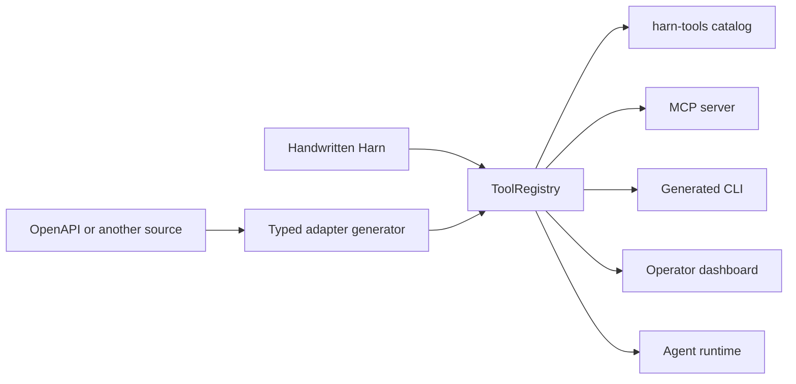

# Tool adapter architecture

Harn treats an integration as an executable typed registry, not as an MCP
server, a command-line program, or an OpenAPI document. Those formats are
inputs and projections around one runtime-owned contract.

## Why OpenAPI is an input

OpenAPI 3.1 already supplies most operation data Harn needs: stable operation
identifiers, descriptions, parameters, request and response JSON Schemas,
security declarations, and HTTP bindings. Its standard extension mechanism
also permits namespaced `x-harn` fields for presentation choices that are not
part of HTTP.

OpenAPI does not own executable handler closures, Harn capability authority,
approval policy, deferred tool loading, or the lifecycle of non-HTTP
integrations. It also does not describe MCP resources and prompts or every CLI
presentation choice. Making an OpenAPI-shaped catalog the runtime owner would
force handwritten, GraphQL, protobuf, database, and local-library integrations
through an HTTP-specific abstraction.

`harn-openapi` therefore translates operations into typed SDK functions and a
`ToolRegistry`. Its `x-harn` object only overrides metadata that OpenAPI does
not standardize. Future generators should end at the same registry boundary.

## The owning contract

A live `ToolRegistry` contains the portable contract and the executable handler
for each operation. Harn validates and normalizes it once when an adapter
publishes or projects the registry. The normalized entry contains:

- stable name, title, and description;
- input, output, and declared application-error JSON Schemas;
- one declared execution backend, with a local handler closure for in-VM tools;
- Harn execution policy and protocol annotations;
- closed CLI, MCP, catalog, dashboard, and agent/model audiences;
- CLI parent metadata plus leaf paths, argument tokens, help, and completion hints;
- typed source coordinates with a protocol-specific binding object;
- deferred-loading, icon, execution, and namespaced extension metadata.

The handler is intentionally absent from the serializable `harn-tools/2.0`
catalog. A catalog can cross a process or language boundary; execution remains
attached to the live registry in its owning Harn VM.

## Adapter behavior

The CLI and MCP adapters load a script through the same registry loader. The
loader installs project capabilities and connectors, runs the script once,
captures every published capability on the same thread, validates the complete
registry, and retains the VM and connector lease for later dispatch.

MCP projects only MCP-audience entries onto protocol discovery and calls their
original handlers. The CLI builds its command tree only from CLI-audience
entries, validates merged JSON and flag input against the same schema, calls
that handler, validates its output or declared error, and renders the selected
output format.
The static catalog applies its own audience through the same normalization
without carrying runtime-only values. A future dashboard adapter consumes the
same normalized governance field rather than maintaining another exposure
list.

The agent loop is also an adapter. It projects the executable registry once at
its option boundary, before prompt guidance, progressive search, surface
narrowing, schema generation, or dispatch can inspect it. Direct LLM calls use
the same normalized `agent` projection. A tool intentionally reserved for an
operator surface therefore cannot leak its name or instructions to the model,
appear in a search result, or execute through a forged call.

MCP needs each tool schema to stand alone. Its projection follows reachable
catalog components, moves them under `$defs`, and rebases their local
references. This preserves schema meaning for ordinary component graphs. Harn
fails server preparation when resource-scope keywords or external references
make that move unsafe. The portable catalog remains able to represent the full
Draft 2020-12 vocabulary; a transport projection must not narrow its owner.

MCP 2026-07-28 permits any JSON value in structured tool output. Harn therefore
preserves the catalog's canonical output schema and value without an
adapter-specific wrapper. Inline calls and task completions share one
`CallToolResult` projection, so asynchronous execution cannot create a second
result contract.

At load time Harn turns the portable catalog into one immutable prepared
catalog. It compiles Draft 2020-12 input, output, and application-error
validators, stable name lookup, MCP discovery documents, and a
framework-independent CLI tree once.
CLI parsing, help, shell completion, MCP, tasks, replay, and exported function
dispatch all use that object. They do not rebuild command trees, compile
schemas, or recover component context per request.

A raw Harn `throw` becomes application data only when the tool has an
`errorSchema` and the value satisfies it. Undeclared throws and VM control
failures remain runtime errors. A declared throw with the wrong shape is a
contract violation. Human diagnostics never stringify an undeclared thrown
value; they report only its value-free runtime category. CLI and MCP consume
this one classification: JSON CLI
output uses a closed failure envelope, while MCP returns `isError: true` with
typed data below
`_meta["com.harnlang/toolContract"].applicationError`. Neither adapter
publishes error data as success `structuredContent`.

This contract sits below both transport formats. OpenAPI
[Response Objects](https://spec.openapis.org/oas/v3.1.1.html#response-object)
describe payloads attached to HTTP status codes, so an HTTP adapter can project
Harn application errors into a `422` response without making HTTP the semantic
owner. MCP tools declare `inputSchema` and `outputSchema`, but the
[tool contract](https://modelcontextprotocol.io/specification/draft/server/tools)
has no declared error schema. Harn therefore uses MCP's `_meta` extension point
for discovery and keeps `isError` as the protocol-native result signal.

## Language bridges

`harn-tools/2.0` is the stable boundary for documentation, compatibility
checks, and generated types in other languages. It is not a remote execution
protocol by itself. A language bridge needs two pieces:

Version 2 is a direct pre-launch cutover. It adds the application-error
contract and intentionally rejects version 1 catalogs. Regenerate the catalog,
JSON Schema, and language bindings together rather than mixing readers and
writers from the two versions.

1. generated native input and output types from the catalog's JSON Schemas;
2. an explicit transport or embedding boundary that resolves a catalog entry
   to its live handler.

Generated native APIs can map `outputSchema` to their success type and
`errorSchema` to their application-error type without confusing a Harn
`Result<T, E>` return value with a thrown `E`. `Result<T, E>` remains ordinary
success-channel data unless the callable separately declares `throws E`.

That separation keeps type generation reusable across in-process embedding,
MCP, HTTP, and future transports. A bridge must not infer execution semantics
from `_meta`; Harn policy and source coordinates have typed fields.

Harn publishes the catalog contract as Draft 2020-12 JSON Schema and strict
TypeScript. Both artifacts come from the Rust DTOs that validate live registry
and export catalogs. This makes the DTO module the semantic owner and the
published files mechanical projections. OpenAPI extensions, MCP fields, and
SDK-local interfaces cannot silently become competing catalog definitions.

Static Harn exports project into the same catalog without executing `main`.
This route resolves Harn input and output types into JSON Schemas for SDK
generation. It does not import route configuration, authentication, queues,
retries, or worker policy into the portable contract.

## Current boundary

The registry now covers executable tools, a nested CLI with portable argument
metadata and shell completion, MCP tool discovery and dispatch, static export
inspection, and a portable generated contract. MCP
resources and prompts share the script loader. They are not part of the tool
catalog because they have different invocation and content contracts.
Streaming output, interactive CLI prompts, pagination UX, installable
completion packaging, and generated native language packages are later
projections. They should extend this registry or a sibling typed capability
registry, not create another operation owner.
